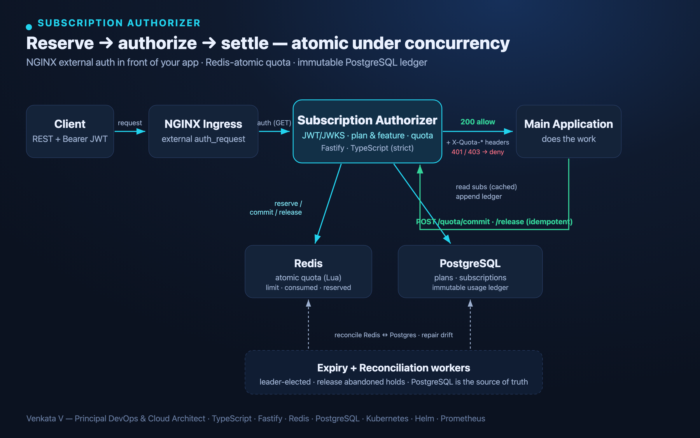

# Subscription Authorizer

External subscription / points / token access‑control service for a Kubernetes app.
NGINX Ingress calls this service (`auth_request`) before every protected request; it
validates the JWT, checks the tenant's subscription and plan features, and **atomically
reserves** estimated points in Redis so concurrent traffic can never oversell a plan.
The application later **commits** actual usage or **releases** the unused hold. Every
movement is written to an immutable PostgreSQL usage ledger.

> Design & rationale: [`docs/TECHNICAL_SPEC.md`](docs/TECHNICAL_SPEC.md).
> Review of the original brief: [`docs/REVIEW.md`](docs/REVIEW.md).



## Status — build in progress (phased)

| Phase | Scope | State |
|---|---|---|
| 0 | Repo, config, Docker, compose, health | ✅ |
| 1 | Migrations + seed, Redis atomic Lua core | ✅ |
| 2 | JWT verify (JWKS+alg allowlist), operation‑cost, subscription cache, quota reserve, `/internal/authorize` | ✅ |
| 3 | commit / release + ledger, late‑commit race, internal S2S auth | ✅ |
| 4 | Main‑app quota client/middleware (resilient) | ✅ |
| 5 | Expiry + reconciliation workers (leader‑elected) | ✅ |
| 6 | Kubernetes manifests + Helm chart (deployed to kind) | ✅ |
| 7 | Prometheus metrics, ServiceMonitor + alert rules | ✅ |

**All phases complete** — every phase built **and verified** against real Postgres, Redis, and a real Kubernetes (kind) cluster.

## Run locally

```bash
docker compose up --build          # postgres + redis + authorizer (+ prometheus)
curl -s localhost:8080/health/ready | jq
```

The authorizer runs migrations on boot (`Dockerfile` CMD) and seeds three plans plus
active / expired / exhausted test subscriptions.

## Develop

```bash
npm install
npm run migrate:dev                # apply migrations against DATABASE_URL
npm run dev                        # hot-reload server (tsx)
npm test                           # vitest (needs a reachable REDIS_URL)
```

## Atomic quota model (Redis)

Key `quota:{tenantId}:{period}` → hash `{ limit, consumed, reserved }`,
`remaining = limit - consumed - reserved`. All mutations go through Lua scripts
(`src/redis/scripts/`) so they are atomic across every authorizer replica:

- `reserve.lua` — reserve estimated units (rejects when `remaining < est`).
- `commit.lua`  — move actual units to `consumed`, release the remainder (overage‑capped).
- `release.lua` — return an unsettled hold.
- `expire.lua`  — worker‑driven release of abandoned holds (Postgres is source of truth).

## Verify it yourself

Reproducible demos (Docker + Helm required):

```bash
bash scripts/demo-atomicity.sh   # 100 concurrent reservations never oversell the limit
bash scripts/demo-e2e.sh         # authorize -> commit against a live Postgres+Redis stack
bash scripts/demo-validate.sh    # promtool checks the alert rules; helm lint + template
```

## Main-app integration (Phase 4)

The main application mounts the middleware, then settles usage explicitly. Commit/release
are idempotent, time-bounded, retried with backoff, and never retried on 4xx.

```ts
import { QuotaClient } from 'subscription-authorizer/clients/quota.client';
import { registerQuotaMiddleware, settleCommit } from 'subscription-authorizer/middleware/quotaContext';

const quota = new QuotaClient({
  baseUrl: process.env.QUOTA_AUTHORIZER_URL!,   // http://subscription-authorizer.auth.svc
  secret: process.env.INTERNAL_SERVICE_TOKEN_SECRET!,
});
registerQuotaMiddleware(app, quota); // parses X-Quota-* headers; auto-releases on error

app.post('/api/ai/generate', async (req, reply) => {
  const result = await callModel(req.body);                  // do the work
  const actualUnits = tokensToPoints(result.usage);          // e.g. input+output tokens -> points
  await settleCommit(req, quota, actualUnits);               // bill exact usage, release remainder
  return result;
});
// If the handler throws, the onError hook releases the reservation automatically.
```

## Layout
See [`docs/TECHNICAL_SPEC.md#19`](docs/TECHNICAL_SPEC.md) for the full structure.
